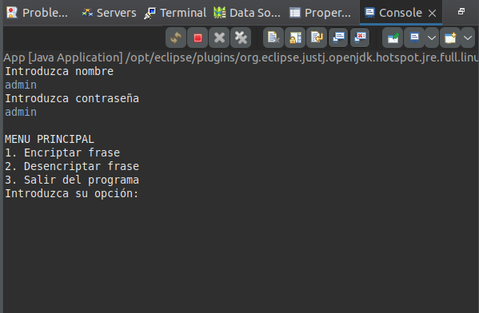
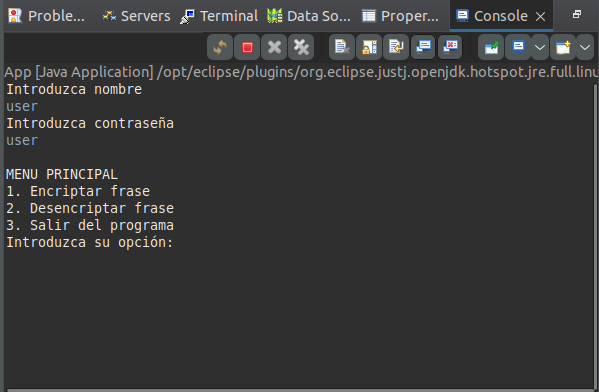
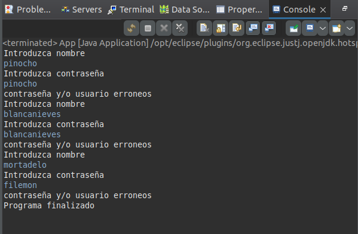
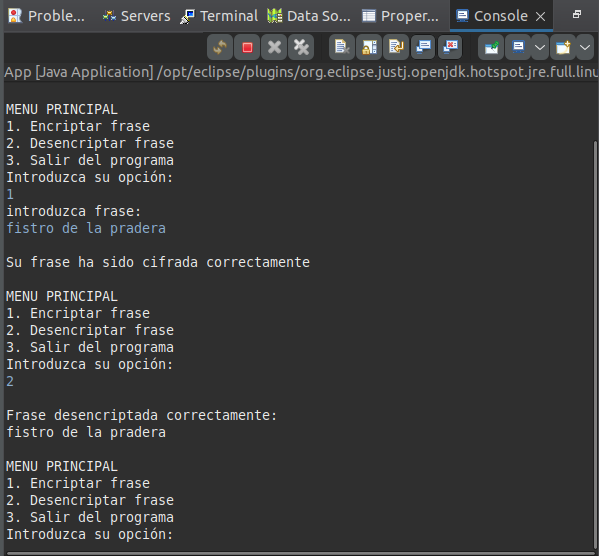

# AE3 Criptografía
Documento de Demostración del Proyecto de Autenticación y Encriptación

[Link a Github](https://github.com/JulianMendezEdix/AE3_Criptograf-a)

Programación de Servicios y Procesos - Sept 2023 PER 9318

Julián Méndez Podadera

## Introducción
Este documento presenta una descripción detallada y los resultados obtenidos del proyecto de Autenticación y Encriptación desarrollado en Java. El objetivo principal de este proyecto es demostrar la capacidad de gestionar la autenticación de usuarios y la encriptación/desencriptación de frases utilizando el algoritmo AES.

---

## Descripción de la Actividad
La actividad consiste en desarrollar una aplicación en Java que permita a los usuarios autenticarse y luego encriptar o desencriptar una frase. La aplicación está dividida en varias clases para una mejor modularidad y mantenimiento del código.

---

## Implementación
### Clase `Usuario`
Esta clase representa a los usuarios del sistema, almacenando su nombre y contraseña hasheada.

import java.util.Objects;

 public class Usuario {
    
    private String nombre;
    private String password;

    /**
     * Constructor para crear un nuevo usuario.
     * 
     * @param nombre El nombre del usuario.
     * @param password La contraseña del usuario.
     */
    public Usuario(String nombre, String password) {
        this.nombre = nombre;
        this.password = password;
    }

    /**
     * Obtiene el nombre del usuario.
     * 
     * @return String El nombre del usuario.
     */
    public String getNombre() {
        return nombre;
    }

    /**
     * Establece o actualiza el nombre del usuario.
     * 
     * @param nombre El nuevo nombre del usuario.
     */
    public void setNombre(String nombre) {
        this.nombre = nombre;
    }

    /**
     * Obtiene la contraseña del usuario.
     * 
     * @return String La contraseña del usuario.
     */
    public String getPassword() {
        return password;
    }

    /**
     * Establece o actualiza la contraseña del usuario.
     * 
     * @param password La nueva contraseña del usuario.
     */
    public void setPassword(String password) {
        this.password = password;
    }

    /**
     * Genera un código hash para el usuario basado en el nombre y la contraseña.
     * 
     * @return int El código hash generado.
     */
    @Override
    public int hashCode() {
        return Objects.hash(nombre, password);
    }

    /**
     * Compara este usuario con otro objeto para determinar la igualdad.
     * 
     * @param obj El objeto con el que se compara.
     * @return boolean Verdadero si los objetos son iguales, falso si no.
     */
    @Override
    public boolean equals(Object obj) {
        if (this == obj)
            return true;
        if (obj == null)
            return false;
        if (getClass() != obj.getClass())
            return false;
        Usuario other = (Usuario) obj;
        return Objects.equals(nombre, other.nombre) && Objects.equals(password, other.password);
    }   
}

### Clase `Autenticacion`
Gestiona la autenticación de los usuarios. Verifica las credenciales y permite hasta tres intentos de inicio de sesión.

public class Autenticacion {
    
    private static Scanner leer = new Scanner(System.in);

    /**
     * Inicializa una lista de usuarios con credenciales predefinidas.
     * 
     * @return ArrayList<Usuario> lista de usuarios inicializados.
     */
    private static ArrayList<Usuario> initUsuarios() {
        Usuario u1 = new Usuario("root", "SBNJTRN+FjG7owHVrKtue7eqdM4RhdRWVl71HXN2d7I=");
        Usuario u2 = new Usuario("admin", "jGl25bVBBBW96Qi9Te4V37Fnqchz/Eu4qB9vKrRIqRg=");
        Usuario u3 = new Usuario("user", "BPiZbadjt6lpsQKO4wB1aerzpjVIbdqyEdUSyFud+Ps=");

        ArrayList<Usuario> usuarios = new ArrayList<>();
        usuarios.add(u1);
        usuarios.add(u2);
        usuarios.add(u3);

        return usuarios;
    }

    /**
     * Verifica las credenciales del usuario.
     * 
     * Permite hasta tres intentos de inicio de sesión. Si las credenciales son
     * correctas, devuelve true, de lo contrario, false.
     * 
     * @return boolean Verdadero si las credenciales son correctas, falso si no.
     */
    public static boolean UsuarioOk() {
        ArrayList<Usuario> usuarios = initUsuarios();

        int count = 0;
        boolean result = false;

        while (count < 3) {
            System.out.println("Introduzca nombre");
            String nombre = leer.next();
            System.out.println("Introduzca contraseña");
            String password = leer.next();

            String passwordHash = hashearPassword(password);
            Usuario usuario = new Usuario(nombre, passwordHash);

            for (Usuario u : usuarios) {
                if (usuario.equals(u)) {
                    result = true;
                    break;
                } else {
                    result = false;
                }
            }
            if (result)
                break;
            else {
                System.out.println("contraseña y/o usuario erroneos");
                count++;
            }
        }

        if (!result) {
            System.out.println("Programa finalizado");
        }
        return result;
    }

    /**
     * Hashea la contraseña proporcionada utilizando SHA-256.
     * 
     * @param password La contraseña a hashear.
     * @return String El hash de la contraseña en Base64, o null si ocurre un error.
     */
    private static String hashearPassword(String password) {
        byte[] passwordHash = password.getBytes();
        MessageDigest md;
        try {
            md = MessageDigest.getInstance("SHA-256");
            md.update(passwordHash);
            byte[] resumen = md.digest();
            String mensajeHashBase64 = Base64.getEncoder().encodeToString(resumen);
            return mensajeHashBase64;
        } catch (NoSuchAlgorithmException e) {
            e.printStackTrace();
            return null;
        }
    }

}

### Clase `Encriptacion`
Encargada de las operaciones de cifrado y descifrado, utilizando el algoritmo AES.

public class Encriptacion {
    
    private static Scanner leer = new Scanner(System.in);

    /**
     * Genera una clave secreta utilizando el algoritmo AES.
     * 
     * @return SecretKey La clave secreta generada, o null si ocurre un error.
     */
    public static SecretKey generarKey() {
        KeyGenerator generator;
        try {
            generator = KeyGenerator.getInstance("AES");
            return generator.generateKey();
        } catch (Exception e) {
            e.printStackTrace();
            return null;
        }
    }

    /**
     * Cifra una frase proporcionada por el usuario utilizando una clave secreta.
     * 
     * @param secretKey La clave secreta para el cifrado.
     * @return byte[] La frase cifrada, o null si ocurre un error.
     */
    public static byte[] cifrarFrase(SecretKey secretKey) {
        System.out.println("introduzca frase: ");
        String frase = leer.nextLine();

        try {
            Cipher cipher = Cipher.getInstance("AES");
            cipher.init(Cipher.ENCRYPT_MODE, secretKey);
            byte[] bytesFrase = frase.getBytes();
            byte[] fraseCifrada = cipher.doFinal(bytesFrase);
            System.out.println("\nSu frase ha sido cifrada correctamente");
            return fraseCifrada;
        } catch (Exception e) {
            e.printStackTrace();
            return null;
        }
    }

    /**
     * Descifra una frase cifrada utilizando la clave secreta correspondiente.
     * 
     * @param fraseCifrada La frase cifrada a descifrar.
     * @param secretKey La clave secreta para el descifrado.
     */
    public static void descifrarFrase(byte[] fraseCifrada, SecretKey secretKey) {
        if (fraseCifrada != null && secretKey != null) {
            try {
                Cipher cipher = Cipher.getInstance("AES");
                cipher.init(Cipher.DECRYPT_MODE, secretKey);
                byte[] fraseDescifrada = cipher.doFinal(fraseCifrada);
                System.out.println("\nFrase desencriptada correctamente:");
                System.out.println(new String(fraseDescifrada));
            } catch (Exception e) {
                e.printStackTrace();
            }
        } else {
            System.out.println("\nNo existe clave para descifrar");
        }
    }
}

### Clase `App`
Es la clase principal que ejecuta la aplicación, integrando todas las clases y funcionalidades mencionadas.

public class App {
    
    private static Scanner leer = new Scanner(System.in);

    /**
     * Método principal que inicia la ejecución del programa.
     * 
     * Este método se encarga de autenticar al usuario y luego proporciona un menú
     * para encriptar y desencriptar frases utilizando AES.
     * 
     * @param args Argumentos de línea de comandos (no utilizados).
     */
    public static void main(String[] args) {
        if (Autenticacion.UsuarioOk()) {
            byte[] fraseCifrada = null;
            SecretKey secretKey = null;
            int opcion = 0;

            while (opcion != 3) {
                opcion = menu();

                switch (opcion) {
                    case 1:
                        secretKey = Encriptacion.generarKey();
                        fraseCifrada = Encriptacion.cifrarFrase(secretKey);
                        break;
                    case 2:
                        Encriptacion.descifrarFrase(fraseCifrada, secretKey);
                        break;
                    case 3:
                        break;
                    default:
                        System.out.println("Introduzca opcion correcta");
                }
            }

            System.out.println("Programa Finalizado");
        }
    }

    /**
     * Muestra el menú de opciones al usuario y recoge su elección.
     * 
     * @return int La opción elegida por el usuario.
     */
    private static int menu() {
        System.out.println("");
        System.out.println("MENU PRINCIPAL");
        System.out.println("1. Encriptar frase");
        System.out.println("2. Desencriptar frase");
        System.out.println("3. Salir del programa");
        System.out.println("Introduzca su opción:");

        int opcion = leer.nextInt();
        leer.nextLine();

        return opcion;
    }
}

---

## Resultados
### Autenticación de Usuario

### Encriptación y desencriptación de Frase

---

## Conclusiones
En este proyecto se ha implementado con éxito un sistema de autenticación y encriptación en Java. La modularidad del código permite una fácil comprensión y mantenimiento. Este sistema podría ser la base para aplicaciones más complejas que requieran medidas de seguridad robustas.

---
